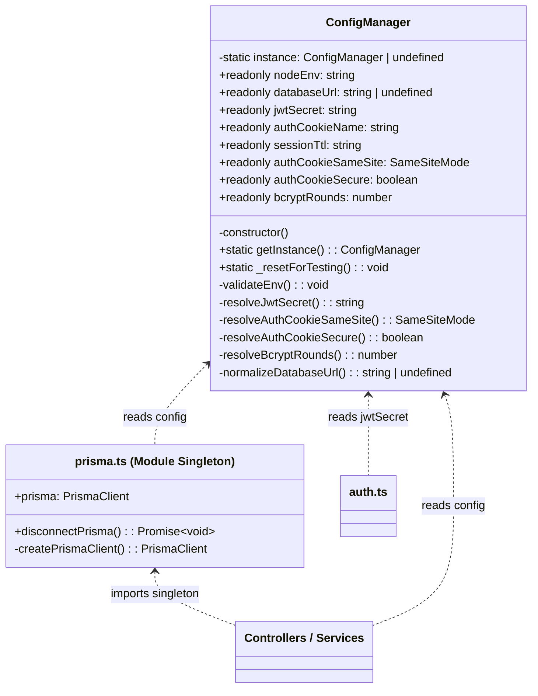

# 01 — Singleton Pattern

> **Classification:** Creational
> **Scope:** Database connection management & centralized configuration

---

## 1. Business Context (The "Why")

The SRS (§1) identifies **Data Vulnerability and Loss** as a critical pain point: *"Paper records are prone to physical damage, loss, and human error during transcription."* The system's response is a **cloud-hosted PostgreSQL database** (SRS §4, §11) accessed through a single, managed connection.

Without a controlled connection strategy, every module that touches the database could independently instantiate its own client. In a Node.js/Express backend that hot-reloads during development, this leads to:

- **Connection pool exhaustion** — Each restart leaks open connections until the database rejects new ones.
- **Inconsistent configuration** — Environment variables (`DATABASE_URL`, `JWT_SECRET`, `SESSION_TTL`) parsed in multiple places violate **DRY** and risk divergent runtime behaviour.
- **Operational fragility** — An uncoordinated shutdown cannot guarantee that all connections are cleanly closed, violating the 99.5% uptime target (NFR-2.2).

The Singleton pattern solves all three problems by guaranteeing a **single, shared instance** across the entire application lifecycle.

---

## 2. Implementation Details (The "How")

The Singleton pattern is applied in **two complementary modules**:

### 2.1 Prisma Client Singleton

| Attribute | Value |
|---|---|
| **File** | `backend/src/lib/prisma.ts` |
| **Mechanism** | Module-scoped constant + `globalThis` caching for dev hot-reload |
| **Adapter** | `@prisma/adapter-pg` (Prisma 7.x driver adapter pattern) |
| **Shutdown** | `disconnectPrisma()` — closes both the Prisma client and the underlying `pg.Pool` |

### 2.2 ConfigManager Singleton

| Attribute | Value |
|---|---|
| **File** | `backend/src/config/ConfigManager.ts` |
| **Class** | `ConfigManager` |
| **Mechanism** | Classic GoF Singleton — private constructor, private static instance, public `getInstance()` |
| **Responsibilities** | Parses, validates, and freezes: `NODE_ENV`, `DATABASE_URL`, `JWT_SECRET`, `AUTH_COOKIE_NAME`, `SESSION_TTL`, `AUTH_COOKIE_SAME_SITE`, `AUTH_COOKIE_SECURE`, `BCRYPT_ROUNDS` |

---

## 3. Visual Architecture



---

## 4. Code Traceability

### ConfigManager — Classic GoF Singleton

```typescript
// backend/src/config/ConfigManager.ts (excerpt)
export class ConfigManager {
  private static instance: ConfigManager | undefined;

  public readonly nodeEnv: string;
  public readonly databaseUrl: string | undefined;
  public readonly jwtSecret: string;
  // ... additional readonly properties ...

  private constructor() {
    this.nodeEnv = process.env.NODE_ENV ?? DEFAULT_NODE_ENV;
    this.databaseUrl = this.normalizeDatabaseUrl(process.env.DATABASE_URL);
    this.jwtSecret = this.resolveJwtSecret();
    // ... parse, validate, and freeze all config ...
    this.validateEnv();
  }

  public static getInstance(): ConfigManager {
    if (!ConfigManager.instance) {
      ConfigManager.instance = new ConfigManager();
    }
    return ConfigManager.instance;
  }
}
```

### Prisma Client — Module-Level Singleton

```typescript
// backend/src/lib/prisma.ts (excerpt)
const globalForPrisma = globalThis as unknown as {
  prisma: PrismaClient | undefined;
  prismaPool: Pool | undefined;
};

function createPrismaClient(): PrismaClient {
  const connectionString = config.databaseUrl;
  const pool = new Pool({ connectionString });
  globalForPrisma.prismaPool = pool;
  const adapter = new PrismaPg(pool);
  return new PrismaClient({ adapter, /* ... */ });
}

// The singleton: reuse existing instance OR create a new one
export const prisma = globalForPrisma.prisma ?? createPrismaClient();

if (config.nodeEnv !== "production") {
  globalForPrisma.prisma = prisma;
}
```

---

## 5. Trade-offs & Rationale

| Consideration | Decision | Justification |
|---|---|---|
| **Classic class Singleton vs. module-level constant** | Both are used — `ConfigManager` uses the classic pattern; `prisma.ts` uses a module-scoped export. | `ConfigManager` needs a private constructor to enforce parse-once semantics. Prisma's singleton is naturally module-scoped since Node.js caches `require()`/`import` results. The `globalThis` fallback handles Vite/ts-node hot-reload edge cases. |
| **Testability** | `ConfigManager` exposes `_resetForTesting()` to clear the instance between test suites. | Without a reset hook, Singleton state leaks across tests—making them order-dependent and brittle. |
| **Thread safety** | Not required. | Node.js executes JavaScript on a single thread. There is no race condition when checking `if (!instance)`. |
| **Why not Dependency Injection?** | DI frameworks (e.g., InversifyJS, tsyringe) add complexity disproportionate to a two-user system. | For a student project with a small team, the Singleton provides the same "single instance" guarantee with minimal boilerplate. If the system scales to microservices, migrating to DI is straightforward because all consumers already import from a single module. |

> [!TIP]
> **SRP in action:** If the configuration source changes (e.g., from `.env` to AWS Secrets Manager), only `ConfigManager` needs modification. Every consumer—auth, database, middleware—remains untouched.
