# 02 — Factory Method Pattern

> **Classification:** Creational
> **Scope:** Standardized creation of Member payloads, Payment payloads, and Report DTOs

---

## 1. Business Context (The "Why")

The SRS (§1) highlights two operational risks that stem from **inaccurate tracking** and **lack of business intelligence**:

- *"There is a significant risk of human error in tracking member payments, expiration dates, and equipment status."* (SRS §1, Pain Point 2)
- *"The absence of historical data makes it nearly impossible to conduct business analysis or generate automated reports."* (SRS §1, Pain Point 4)

Without a centralized creation mechanism, controllers and services would manually assemble database payloads and API response shapes. This causes:

- **Tight Coupling** — Controllers become coupled to Prisma's exact `CreateInput` types and database schema details.
- **Code Duplication** — Data normalization logic (e.g., splitting a full name into `firstName` / `lastName`, defaulting `status` to `ACTIVE`) would be duplicated in every handler that creates a member.
- **Lack of Flexibility** — Changes to the database schema or report DTO shapes would require modifying multiple endpoint handlers across the codebase.

The Factory Method pattern centralizes all object-construction logic behind a **generic `IFactory<TInput, TOutput>` interface**, ensuring that controllers remain clean and focused on request handling.

---

## 2. Implementation Details (The "How")

### 2.1 Files & Classes

| File | Class / Interface | Role |
|---|---|---|
| `backend/src/patterns/factory-method/factory.interface.ts` | `IFactory<TInput, TOutput>` | Generic contract — all factories implement `create(input): output` |
| `backend/src/patterns/factory-method/member.factory.ts` | `MemberFactory` | Transforms raw HTTP input → `Prisma.MemberCreateInput` |
| `backend/src/patterns/factory-method/payment.factory.ts` | `PaymentFactory` | Transforms validated payment data → `Prisma.PaymentUncheckedCreateInput` |
| `backend/src/patterns/factory-method/report.factory.ts` | `ExpiryAlertFactory`, `InventoryAlertFactory`, `AtRiskMemberFactory`, `RevenueForecastFactory`, `PeakUtilizationFactory` | Transform domain models → frontend-ready DTOs |
| `backend/src/patterns/factory-method/report-creator.ts` | `ReportCreator` | Parameter-driven dispatcher — selects the correct factory at runtime based on `ReportType` |
| `backend/src/patterns/factory-method/report.types.ts` | `ReportType` (enum), `ReportOutput` (union type) | Type-safe report type discriminator |

### 2.2 Product Types

| Factory | Input (TInput) | Output (TOutput / Product) |
|---|---|---|
| `MemberFactory` | `MemberFactoryInput` (fullName, contactNumber, notes) | `Prisma.MemberCreateInput` (firstName, lastName, status=ACTIVE, …) |
| `PaymentFactory` | `PaymentFactoryInput` (memberId, planId, amount, …) | `Prisma.PaymentUncheckedCreateInput` |
| `ExpiryAlertFactory` | `Member` (Prisma domain model) | `ExpiryAlertDTO` (id, name, expiryDate, contactNumber) |
| `InventoryAlertFactory` | `InventoryAlertInput` (equipment, threshold) | `InventoryAlertDTO` (id, itemName, category, quantity, threshold) |
| `AtRiskMemberFactory` | `AtRiskMemberInput` (member, daysUntilExpiry, lastCheckInTime) | `AtRiskMemberDTO` (id, name, riskLevel, …) |
| `RevenueForecastFactory` | `RevenueForecastInput` (projection, baseline, churn, forecast) | `RevenueForecastDTO` |
| `PeakUtilizationFactory` | `PeakUtilizationInput` (hour, planName, count) | `PeakUtilizationDTO` |

---

## 3. Visual Architecture

```mermaid
classDiagram
    class IFactory~TInput, TOutput~ {
        <<interface>>
        +create(input: TInput): TOutput
    }

    class MemberFactory {
        +create(input: MemberFactoryInput): Prisma.MemberCreateInput
    }

    class PaymentFactory {
        +create(input: PaymentFactoryInput): Prisma.PaymentUncheckedCreateInput
    }

    class ExpiryAlertFactory {
        +create(member: Member): ExpiryAlertDTO
    }

    class InventoryAlertFactory {
        +create(input: InventoryAlertInput): InventoryAlertDTO
    }

    class AtRiskMemberFactory {
        +create(input: AtRiskMemberInput): AtRiskMemberDTO
    }

    class RevenueForecastFactory {
        +create(input: RevenueForecastInput): RevenueForecastDTO
    }

    class PeakUtilizationFactory {
        +create(input: PeakUtilizationInput): PeakUtilizationDTO
    }

    class ReportCreator {
        -static expiryAlertFactory
        -static inventoryAlertFactory
        -static atRiskMemberFactory
        -static revenueForecastFactory
        -static peakUtilizationFactory
        +static createReport(type, data): ReportOutput
        +static createReportBatch(type, data[]): ReportOutput[]
    }

    IFactory <|.. MemberFactory
    IFactory <|.. PaymentFactory
    IFactory <|.. ExpiryAlertFactory
    IFactory <|.. InventoryAlertFactory
    IFactory <|.. AtRiskMemberFactory
    IFactory <|.. RevenueForecastFactory
    IFactory <|.. PeakUtilizationFactory

    ReportCreator --> ExpiryAlertFactory : delegates
    ReportCreator --> InventoryAlertFactory : delegates
    ReportCreator --> AtRiskMemberFactory : delegates
    ReportCreator --> RevenueForecastFactory : delegates
    ReportCreator --> PeakUtilizationFactory : delegates
```



---

## 4. Code Traceability

### The Generic Interface

```typescript
// backend/src/patterns/factory-method/factory.interface.ts
export interface IFactory<TInput, TOutput> {
    create(input: TInput): TOutput;
}
```

### Concrete Factory — MemberFactory

```typescript
// backend/src/patterns/factory-method/member.factory.ts
export class MemberFactory
  implements IFactory<MemberFactoryInput, Prisma.MemberCreateInput>
{
  create(input: MemberFactoryInput): Prisma.MemberCreateInput {
    const [firstName, ...lastNameParts] = input.fullName.split(' ');
    return {
      firstName,
      lastName: lastNameParts.join(' '),
      contactNumber: input.contactNumber,
      notes: input.notes,
      status: MemberStatus.ACTIVE, // Encapsulated default state logic
    };
  }
}
```

### ReportCreator — Runtime Dispatcher

```typescript
// backend/src/patterns/factory-method/report-creator.ts (excerpt)
public static createReport(type: ReportType, data: unknown): unknown {
  switch (type) {
    case ReportType.EXPIRY_ALERT:
      if (!this.isMember(data)) {
        throw new Error('Invalid input for report type: EXPIRY_ALERT');
      }
      return this.expiryAlertFactory.create(data);
    case ReportType.AT_RISK_MEMBER:
      if (!this.isAtRiskMemberInput(data)) {
        throw new Error('Invalid input for report type: AT_RISK_MEMBER');
      }
      return this.atRiskMemberFactory.create(data);
    // ... additional cases for INVENTORY_ALERT, REVENUE_FORECAST, PEAK_UTILIZATION
    default:
      throw new Error(`No report factory registered for type: ${type}`);
  }
}
```

### Client Usage in Controller

```typescript
// Example usage in a controller
const memberFactory = new MemberFactory();
const memberCreatePayload = memberFactory.create({ fullName, contactNumber, notes });
const createdMember = await prisma.member.create({ data: memberCreatePayload });
```

---

## 5. Trade-offs & Rationale

| Consideration | Decision | Justification |
|---|---|---|
| **Generic interface vs. Abstract class** | `IFactory<TInput, TOutput>` is a TypeScript interface, not an abstract class. | Interfaces have zero runtime footprint and align with TypeScript's structural type system. An abstract class would add an unnecessary inheritance chain for stateless transformations. |
| **ReportCreator as a static dispatcher** | `ReportCreator.createReport()` uses a `switch` on `ReportType` to select the correct factory. | This acts as a **Parameterized Factory Method**: the caller specifies *what* to build, and the dispatcher handles *how*. Adding a new report type requires creating one new factory class and one new `case` branch — no existing logic changes (OCP). |
| **Runtime type guards** | Each `case` branch validates the input shape before invoking the factory. | Since report data crosses module boundaries (database → service → controller → API), runtime guards prevent malformed rows from silently producing corrupted DTOs. |
| **Batch support** | `createReportBatch()` provides a list-level wrapper around `createReport()`. | Many report endpoints return arrays (e.g., "all expiring members"). The batch method guards *every* item, ensuring one bad row doesn't corrupt the entire response. |
| **Team collaboration** | Decoupling creation from consumption lets team members work independently. | One developer can modify `MemberFactory`'s name-splitting logic while another adjusts the controller's HTTP response format — without merge conflicts. |
