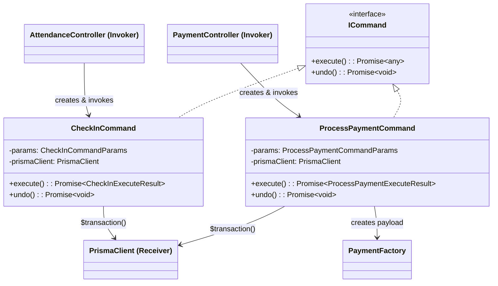

# 03 — Command Pattern

> **Classification:** Behavioral
> **Scope:** Check-in logic and the transactional "Undo Payment" feature

---

## 1. Business Context (The "Why")

Two SRS requirements make the Command pattern indispensable:

### 1.1 Transactional Atomicity (NFR-2.1)

> *"The creation of a Payment record and the update of the Member's `expiry_date` must be executed as a single, atomic database transaction (ACID compliance), ensuring data consistency."*

A payment involves **two coupled mutations**: creating a `Payment` row and updating the `Member`'s `expiryDate` and `status`. If either step fails independently, the gym's financial records diverge from membership state — the exact "inaccurate tracking" problem identified in SRS §1.

### 1.2 Undo Payment (US-2.3 / URD §2.2)

> *"Once a payment is submitted, the system shall provide the user with an undo button for 5 seconds before it switches back to the usual submit button. Once the undo button is clicked, the system reverts back the member's previous state using the processed payment's `previousStatus` and `previousExpiryDate` fields respectively."*

Without the Command pattern, implementing "undo" would require duplicating rollback logic in every controller or service that processes payments — violating SRP and DRY.

### 1.3 Check-in Validation (FR-7.1–FR-7.3)

> *"The system shall enforce a validation rule: check-in is only permitted if the associated Member's status is 'Active'."*

The check-in operation, though simpler than payment, also benefits from encapsulation: it validates member status, creates an attendance record atomically, and supports undo (deleting the check-in record within 5 seconds).

---

## 2. Implementation Details (The "How")

| File | Class / Interface | Role |
|---|---|---|
| `backend/src/patterns/command/command.interface.ts` | `ICommand` | Contract — every command must implement `execute()` and `undo()` |
| `backend/src/patterns/command/process-payment.command.ts` | `ProcessPaymentCommand` | Atomic payment processing with snapshot-based undo |
| `backend/src/patterns/command/check-in.command.ts` | `CheckInCommand` | Atomic attendance logging with delete-based undo |

### Key Technical Details

- **`ProcessPaymentCommand.execute()`** uses `Prisma.$transaction()` with `Serializable` isolation level and `SELECT ... FOR UPDATE` row-level locks to prevent race conditions.
- **Snapshot for undo:** The payment record stores `previousStatus` and `previousExpiryDate` at creation time. This is a **Memento-like approach** — the data needed to reverse the operation is persisted alongside the operation itself.
- **Retry logic:** `execute()` retries up to 3 times on `P2034` (Prisma transaction conflict) errors, making the system resilient to concurrent payment submissions.
- **`CheckInCommand.undo()`** simply deletes the attendance record within the same transactional boundary.

---

## 3. Visual Architecture



---

## 4. Code Traceability

### The Command Interface

```typescript
// backend/src/patterns/command/command.interface.ts
export interface ICommand {
  execute(): Promise<any>;
  undo(): Promise<void>;
}
```

### ProcessPaymentCommand — Execute (Snapshot + Atomic Transaction)

```typescript
// backend/src/patterns/command/process-payment.command.ts (excerpt)
export class ProcessPaymentCommand implements ICommand {
  constructor(
    private readonly params: ProcessPaymentCommandParams,
    private readonly prismaClient = prisma,
  ) {}

  async execute(): Promise<ProcessPaymentExecuteResult> {
    // ... validation ...
    for (let attempt = 1; attempt <= MAX_PAYMENT_TX_ATTEMPTS; attempt += 1) {
      try {
        const result = await this.prismaClient.$transaction(async (tx) => {
          // 1. Lock the member row to prevent concurrent modifications
          const lockedMembers = await tx.$queryRaw`
            SELECT id, status, "expiryDate" FROM "members"
            WHERE id = ${memberId} FOR UPDATE`;

          // 2. Calculate new expiry date based on current state
          const now = new Date();
          let newExpiryDate: Date;
          if (lockedMember.status === MemberStatus.INACTIVE
              || !lockedMember.expiryDate
              || lockedMember.expiryDate < now) {
            newExpiryDate = new Date(now);
          } else {
            newExpiryDate = new Date(lockedMember.expiryDate);
          }
          newExpiryDate.setDate(newExpiryDate.getDate() + planDurationDays);

          // 3. Create payment with snapshot of previous state
          const payment = await tx.payment.create({
            data: {
              ...paymentFactory.create({ memberId, planId, amount, paymentMethod, referenceNumber, processedById }),
              previousStatus: lockedMember.status,       // Snapshot for undo
              previousExpiryDate: lockedMember.expiryDate, // Snapshot for undo
            },
          });

          // 4. Update member status atomically
          const updatedMember = await tx.member.update({
            where: { id: memberId },
            data: { expiryDate: newExpiryDate, status: MemberStatus.ACTIVE },
          });

          return { payment, updatedMember };
        }, { isolationLevel: Prisma.TransactionIsolationLevel.Serializable });

        return result;
      } catch (error) {
        if (isRetryableTransactionError(error) && attempt < MAX_PAYMENT_TX_ATTEMPTS) continue;
        throw error;
      }
    }
  }
```

### ProcessPaymentCommand — Undo (State Restoration)

```typescript
  async undo(): Promise<void> {
    await this.prismaClient.$transaction(async (tx) => {
      const paymentToUndo = await tx.payment.findUnique({
        where: { id: paymentId },
        select: { id: true, memberId: true, previousStatus: true, previousExpiryDate: true },
      });

      // Restore member to previous state using the snapshot
      await tx.member.update({
        where: { id: paymentToUndo.memberId },
        data: {
          status: toMemberStatus(paymentToUndo.previousStatus),
          expiryDate: paymentToUndo.previousExpiryDate,
        },
      });

      // Delete the payment record
      await tx.payment.delete({ where: { id: paymentId } });
    }, { isolationLevel: Prisma.TransactionIsolationLevel.Serializable });
  }
}
```

---

## 5. Trade-offs & Rationale

| Consideration | Decision | Justification |
|---|---|---|
| **Memento-in-record vs. separate history table** | The previous state (`previousStatus`, `previousExpiryDate`) is stored directly on the `Payment` record. | A separate history table would be architecturally cleaner but adds schema complexity for a feature that only needs a single undo step. The in-record approach is simpler, atomic, and sufficient for the 5-second undo window (US-2.3). |
| **Serializable isolation** | Both `execute()` and `undo()` use `Prisma.TransactionIsolationLevel.Serializable`. | This is the strongest isolation level, preventing phantom reads and write skew. For a small gym with low concurrency, the performance cost is negligible, while the data integrity guarantee is essential (NFR-2.1). |
| **Retry logic** | Up to 3 retries on `P2034` serialization failures. | Serializable transactions can conflict under concurrent access. Retrying is safe because the operation is idempotent within its transaction boundary. |
| **`SELECT ... FOR UPDATE`** | Explicit row-level lock before reading member state. | Prevents a TOCTOU (time-of-check-to-time-of-use) race: without the lock, two concurrent payments could both read the same `expiryDate` and overwrite each other's extension. |
| **Why not a Command Queue?** | Commands are created and executed synchronously within the HTTP request lifecycle. | A queue (e.g., Bull, RabbitMQ) is appropriate for high-throughput systems. For a two-user gym (Admin + Staff), inline execution is simpler and meets the < 5-second SLA (NFR-1.1). |

> [!IMPORTANT]
> **SRS Traceability:** The Command pattern is the primary mechanism ensuring **NFR-2.1 (Atomic Transactions)** and **US-2.3 (Undo Payment)** are satisfied. Without it, the system cannot guarantee that payment creation and member state updates succeed or fail together.
