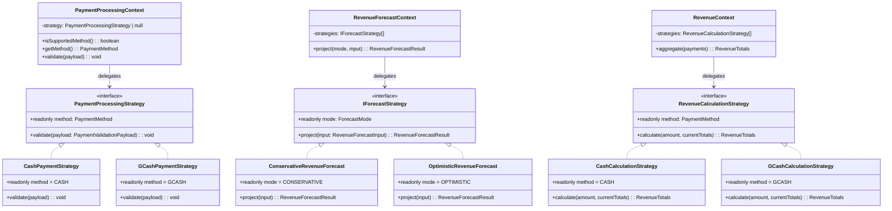

# 04 — Strategy Pattern

> **Classification:** Behavioral
> **Scope:** Swappable Payment Method validation, Revenue Calculation, and Revenue Forecasting algorithms

---

## 1. Business Context (The "Why")

The SRS defines three distinct business domains where the **algorithm varies by type** but the **interface remains constant**:

### 1.1 Payment Method Validation (FR-2.1)

> *"The system shall record transaction details including Amount, Date Paid, Payment Type (Cash/Gcash)…"*

Each payment method has different validation rules:
- **Cash** — only requires a positive amount.
- **GCash** — requires a positive amount *and* a 13-digit reference number.

Without Strategy, a single function would contain a growing `if-else` chain for each payment method. Adding a third method (e.g., Credit Card, Bank Transfer) would require modifying that function — violating OCP.

### 1.2 Revenue Calculation (FR-5.1 / US-5.1)

> *"The system shall generate an on-demand dashboard showing total revenue collected and a breakdown by payment method (e.g., Cash, GCash)."*

Revenue aggregation must route each payment to the correct accumulator bucket (`cash` or `gcash`). The Strategy pattern ensures each payment method's calculation logic is isolated and independently testable.

### 1.3 Revenue Forecasting (FR-5.4 / US-5.4)

> *"The system shall project the following month's revenue using a parallel strategy context."*
> - **FR-5.4.1 (Conservative):** Subtract projected churn from active recurring revenue.
> - **FR-5.4.2 (Optimistic):** Include historical averages of new member sign-ups (i.e., ignore churn deductions).

The owner needs **both** forecasts displayed simultaneously so they can make informed decisions about equipment purchases or supplier contracts (US-5.4). The Strategy pattern allows both algorithms to coexist, be selected at runtime, and be extended independently.

---

## 2. Implementation Details (The "How")

### 2.1 Payment Method Strategy

| File | Class / Interface | Role |
|---|---|---|
| `backend/src/patterns/strategy-pattern/payment-method.strategy.ts` | `PaymentProcessingStrategy` (interface) | Contract — `readonly method` + `validate(payload)` |
| — | `CashPaymentStrategy` | Validates positive amount only |
| — | `GCashPaymentStrategy` | Validates positive amount + 13-digit reference number |
| — | `PaymentProcessingContext` | Context — selects the matching strategy and delegates `validate()` |
| — | `getPaymentContext(paymentMethod)` | Factory function returning a configured context |

### 2.2 Revenue Calculation Strategy

| File | Class / Interface | Role |
|---|---|---|
| `backend/src/services/revenueStrategy.ts` | `RevenueCalculationStrategy` (interface) | Contract — `readonly method` + `calculate(amount, currentTotals)` |
| — | `CashCalculationStrategy` | Adds amount to `cash` bucket |
| — | `GCashCalculationStrategy` | Adds amount to `gcash` bucket |
| — | `RevenueContext` | Context — iterates payments, finds the matching strategy, delegates `calculate()` |

### 2.3 Revenue Forecast Strategy

| File | Class / Interface | Role |
|---|---|---|
| `backend/src/services/revenueForecast.strategy.ts` | `IForecastStrategy` (interface) | Contract — `readonly mode` + `project(input)` |
| — | `ConservativeRevenueForecast` | `forecastedRevenue = baseline − churn` (floored at 0) |
| — | `OptimisticRevenueForecast` | `forecastedRevenue = baseline` (ignores churn) |
| — | `RevenueForecastContext` | Context — finds strategy by `mode` and delegates `project()` |

---

## 3. Visual Architecture



---

## 4. Code Traceability

### Payment Method Strategy — Interface + Concrete Strategies

```typescript
// backend/src/patterns/strategy-pattern/payment-method.strategy.ts (excerpt)
export interface PaymentProcessingStrategy {
  readonly method: PaymentMethod;
  validate(payload: PaymentValidationPayload): void;
}

class CashPaymentStrategy implements PaymentProcessingStrategy {
  readonly method = PaymentMethod.CASH;
  validate(payload: PaymentValidationPayload): void {
    if (!Number.isFinite(payload.amount) || payload.amount <= 0) {
      throw new Error('Amount paid must be a positive number');
    }
  }
}

class GCashPaymentStrategy implements PaymentProcessingStrategy {
  readonly method = PaymentMethod.GCASH;
  validate(payload: PaymentValidationPayload): void {
    if (!Number.isFinite(payload.amount) || payload.amount <= 0) {
      throw new Error('Amount paid must be a positive number');
    }
    const normalizedReferenceNumber = payload.referenceNumber?.trim() ?? '';
    if (!/^\d{13}$/.test(normalizedReferenceNumber)) {
      throw new Error('GCash Reference Number must be exactly 13 digits...');
    }
  }
}
```

### Payment Method Context — Dynamic Selection

```typescript
export class PaymentProcessingContext {
  constructor(private readonly strategy: PaymentProcessingStrategy | null) {}

  validate(payload: PaymentValidationPayload): void {
    if (!this.strategy) throw new Error('Invalid payment method');
    this.strategy.validate(payload);
  }
}

export function getPaymentContext(paymentMethod: unknown): PaymentProcessingContext {
  return new PaymentProcessingContext(
    strategies.find((strategy) => strategy.method === paymentMethod) ?? null,
  );
}
```

### Revenue Forecast Context — Dual-Mode Projection

```typescript
// backend/src/services/revenueForecast.strategy.ts (excerpt)
export interface IForecastStrategy {
  readonly mode: ForecastMode;
  project(input: RevenueForecastInput): RevenueForecastResult;
}

class ConservativeRevenueForecast implements IForecastStrategy {
  readonly mode: ForecastMode = 'CONSERVATIVE';
  project(input: RevenueForecastInput): RevenueForecastResult {
    const forecastedRevenue = Math.max(0,
      input.baselineActivePlanRevenue - input.projectedChurnAdjustment);
    return { projection: this.mode, ...input, forecastedRevenue };
  }
}

class OptimisticRevenueForecast implements IForecastStrategy {
  readonly mode: ForecastMode = 'OPTIMISTIC';
  project(input: RevenueForecastInput): RevenueForecastResult {
    return { projection: this.mode, ...input,
      forecastedRevenue: input.baselineActivePlanRevenue };
  }
}

export class RevenueForecastContext {
  constructor(private readonly strategies: IForecastStrategy[]) {}

  project(mode: ForecastMode, input: RevenueForecastInput): RevenueForecastResult {
    const strategy = this.strategies.find((c) => c.mode === mode);
    if (!strategy) throw new Error('Unsupported forecast mode');
    return strategy.project(input);
  }
}
```

---

## 5. Trade-offs & Rationale

| Consideration | Decision | Justification |
|---|---|---|
| **Three separate Strategy hierarchies** | Payment validation, revenue calculation, and revenue forecasting each have their own interface + context. | Although they share the same structural pattern, their domains are distinct. Merging them into a single interface would couple payment validation to financial forecasting — violating SRP. |
| **Strategy selection via array search** | Contexts find the matching strategy by iterating a small array (`strategies.find(c => c.method === ...)`) | For 2–3 strategies, a linear scan is clearer and faster than a `Map`. If the system scales to many payment methods, migrating to a `Map<PaymentMethod, Strategy>` is a one-line change. |
| **Module-scoped singleton contexts** | `revenueContext` and `revenueForecastContext` are exported as module-level constants. | Strategies are stateless — a single shared instance is safe and avoids unnecessary allocations per request. |
| **GCash reference validation** | `GCashPaymentStrategy` enforces a strict 13-digit numeric regex (`/^\d{13}$/`). | This rule comes directly from the URD (US-2.1 / US-2.2): GCash reference numbers are always 13 digits. Encapsulating this validation in a strategy prevents it from leaking into controller code. |
| **Why not `if-else` chains?** | The Strategy pattern eliminates conditionals from the client code. | Adding a new payment method (e.g., `BankTransfer`) requires creating one new class and registering it in the `strategies` array — zero changes to existing validation, calculation, or forecasting logic (OCP). |

> [!IMPORTANT]
> **SRS Traceability:** The Strategy pattern directly satisfies **FR-5.4 (Multi-Strategy Revenue Forecasting)**. The SRS explicitly requires "parallel strategy context" with **Conservative** (FR-5.4.1) and **Optimistic** (FR-5.4.2) projections — the `RevenueForecastContext` is the literal implementation of this requirement.
